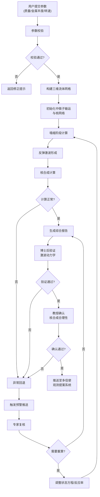

## 1. 产品概述
高精度超新星爆发流体力学与核合成耦合模拟及多信使协同分析平台，为天体物理学家提供端到端的超新星爆发数值模拟解决方案，实现从参数输入、三维流体模拟、核合成计算到多信使数据分析的全流程自动化。

- 主要用途：超新星爆发过程的高精度数值模拟，核合成产额计算，中微子信号分析，多信使观测数据协同处理
- 解决问题：传统模拟流程分散、状态追踪困难、异常检测滞后、数据孤岛等痛点
- 目标用户：天体物理学家、博士后研究员、核天体物理实验室、多信使观测团队
- 产品价值：将模拟周期从数周缩短至数天，提升异常响应效率300%，实现模拟结果的可追溯性和可重复性

## 2. 核心功能

### 2.1 用户角色
| 角色 | 注册方法 | 核心权限 |
|------|----------|----------|
| 博士后研究员 | 机构邮箱注册 | 创建模拟任务、监控计算过程、复核异常、验证激波动力学、提交审批 |
| 教授/首席科学家 | 机构邮箱注册+权限审批 | 确认核合成合理性、审批模拟结果、查看统计看板、接收偏差预警 |
| 天体物理学家 | 机构邮箱注册 | 复核异常预警、调整状态方程参数、修改核反应率 |
| 系统管理员 | 后台分配 | 用户管理、系统配置、日志审计 |

### 2.2 功能模块
1. **首页看板**：系统概览、任务统计、快速创建、最近任务
2. **模拟任务管理**：任务列表、参数配置、状态追踪、模拟日志
3. **实时监控中心**：激波半径监控、中微子光度曲线、核素产额追踪、预警推送
4. **异常复核系统**：预警列表、参数调整、重新模拟、调整日志
5. **审批工作流**：博士后验证、教授确认、审批历史、自动推送
6. **报告生成中心**：激波动画、丰度分布、光变曲线、中微子频谱、PDF导出
7. **数据导出系统**：流体数据导出、核素质量分数、多条件筛选
8. **智能推荐引擎**：参数推荐、状态方程匹配、反应速率优化
9. **统计分析看板**：完成率统计、成功率分析、收敛次数、性能雷达图
10. **系统配置**：状态方程管理、核反应网络版本、预警阈值配置

### 2.3 页面详情
| 页面名称 | 模块名称 | 功能描述 |
|---------|----------|----------|
| 首页看板 | 统计概览 | 展示任务总数、运行中、完成率、今日新增等核心指标卡片 |
| 首页看板 | 快速创建 | 提供前身星参数快速输入表单，一键创建模拟任务 |
| 首页看板 | 最近任务 | 展示最近5个任务的状态、进度、优先级 |
| 首页看板 | 预警提醒 | 实时展示待处理的预警信息，点击跳转复核 |
| 任务列表页 | 筛选器 | 按状态、前身星类型、创建时间、优先级筛选任务 |
| 任务列表页 | 任务卡片 | 展示任务ID、参数、状态流转、进度条、操作按钮 |
| 任务详情页 | 参数配置 | 展示前身星质量、金属丰度、旋转速度等参数 |
| 任务详情页 | 状态流转 | 可视化展示"待校验→网格生成→塌缩阶段→反弹激波→核合成→完成"的状态流转过程 |
| 任务详情页 | 实时监控 | 激波半径、中微子光度、锗/镍产额的实时图表 |
| 任务详情页 | 模拟日志 | 分阶段展示计算日志、错误信息、调整记录 |
| 监控中心 | 激波监控 | 多任务激波半径对比曲线，停滞预警标注 |
| 监控中心 | 中微子监控 | 电子中微子、反电子中微子、重子中微之光度曲线 |
| 监控中心 | 核合成监控 | 镍-56、锗-68等关键核素产额实时追踪 |
| 预警中心 | 预警列表 | 按严重程度分级展示预警，支持批量处理 |
| 预警中心 | 复核面板 | 展示异常数据、专家意见、参数调整选项 |
| 审批中心 | 待审批列表 | 博士后待验证、教授待确认任务列表 |
| 审批中心 | 审批详情 | 激波动力学验证表单、核合成合理性评估 |
| 报告中心 | 报告列表 | 已生成报告的历史记录，支持预览和下载 |
| 报告中心 | 报告生成器 | 自定义报告内容，选择图表类型，生成PDF |
| 数据导出页 | 导出配置 | 选择前身星类型、核反应网络版本、时间窗口 |
| 数据导出页 | 导出任务 | 查看导出进度，下载CSV/FITS/HDF5格式数据 |
| 智能推荐页 | 推荐结果 | 基于历史模拟的最优参数组合推荐 |
| 智能推荐页 | 匹配分析 | 与观测数据的匹配度对比图表 |
| 统计看板 | 每日统计 | 模拟完成率、激波恢复成功率、核网络收敛次数趋势图 |
| 统计看板 | 性能雷达图 | 多维度性能对比（精度、速度、稳定性、收敛性、资源利用率） |
| 系统配置页 | 状态方程管理 | 管理多个状态方程版本，设置默认值 |
| 系统配置页 | 核反应网络 | 管理核反应网络版本，查看反应列表 |
| 系统配置页 | 预警阈值 | 配置激波停滞临界时间、中微子能量异常阈值、镍-56偏差阈值 |

## 3. 核心流程

### 3.1 模拟任务主流程
用户提交前身星参数（质量、金属丰度、旋转速度）→ 系统校验参数合法性 → 自动构建三维流体网格 → 初始化中微子输运与核网络 → 进入塌缩阶段计算 → 反弹激波形成 → 核合成计算 → 生成综合报告 → 提交审批 → 推送至多信使系统

### 3.2 实时监控与预警流程
计算开始 → 实时采集激波半径/中微子光度/核素产额 → 异常检测（激波停滞>临界时间/中微子能量异常）→ 触发多级预警 → 推送至天体物理学家 → 复核调整 → 记录日志

### 3.3 异常检测与重算流程
监控数据异常 → 触发预警 → 专家复核 → 调整状态方程参数或核反应率 → 记录调整日志 → 重新启动模拟 → 对比结果

### 3.4 两级审批流程
模拟完成 → 博士后验证激波动力学（激波速度、激波半径演化、能量守恒）→ 提交教授 → 教授确认核合成合理性（镍-56产额、元素丰度分布、与观测对比）→ 通过后自动推送

### 3.5 镍-56偏差检测流程
检测同一前身星连续三次模拟 → 计算镍-56产额相对偏差 → 偏差>20% → 自动暂停新任务 → 通知首席科学家 → 排查原因后恢复

## 4. 用户界面设计

### 4.1 设计风格
- **主色调**：深空蓝（#0B1E3F）作为主背景，象征宇宙深空；恒星蓝（#1E40AF）作为主色，代表科学与精确；超新星橙（#F97316）作为强调色，突出预警和关键数据
- **辅助色**：中微子紫（#7C3AED）、镍绿（#059669）、锗黄（#EAB308）
- **背景风格**：深空渐变背景，点缀微弱星点纹理，营造宇宙科研氛围
- **按钮风格**：圆角6px，微妙渐变，hover状态有发光效果，禁用状态呈半透明
- **字体**：主字体采用'Inter'，数字和数据展示采用'JetBrains Mono'等宽字体，标题采用'Space Grotesk'
- **布局风格**：卡片式布局，清晰的视觉层级，数据可视化区域采用深色背景突出图表
- **图标风格**：线性图标，细线条，科技感，与物理符号融合设计

### 4.2 页面设计概述
| 页面名称 | 模块名称 | UI元素 |
|---------|----------|--------|
| 首页看板 | 统计概览 | 深空蓝卡片、发光数据数字、趋势箭头、微妙动画 |
| 首页看板 | 状态流转 | 时间轴样式，节点发光动画，进度条渐变填充 |
| 监控中心 | 实时图表 | 深色图表背景、荧光色曲线、动态数据点、预警区域红色高亮 |
| 预警中心 | 预警列表 | 按严重程度（高/中/低）用红/橙/黄三色边框区分 |
| 报告中心 | 报告预览 | 3D卡片翻转效果，PDF缩略图预览 |
| 统计看板 | 雷达图 | 交互式雷达图，多组数据对比，悬停显示详细数值 |
| 任务详情 | 参数配置 | 表单分组，物理量符号标注，单位自动换算 |

### 4.3 响应式设计
- **桌面端**：1280px+，完整功能，多栏布局，侧边导航
- **平板端**：768px-1279px，自适应两栏布局，顶部导航
- **移动端**：<768px，单列布局，底部tab导航，核心功能优先
- **触控优化**：按钮最小48x48px，图表支持双指缩放，滑动手势操作

### 4.4 数据可视化指导
- **激波传播动画**：3D可视化三维流体网格，用颜色映射温度/密度，激波面高亮显示，支持时间轴拖动
- **元素丰度分布**：径向分布曲线+质量分数热力图，对数坐标，支持核素选择
- **光变曲线**：多波段（U/B/V/R/I）对比曲线，误差棒，观测数据点叠加
- **中微子信号频谱**：能量分布直方图， flavor区分，探测器响应函数叠加
- **性能雷达图**：五维度（精度、速度、稳定性、收敛性、资源利用率）蜘蛛网图，多版本对比
