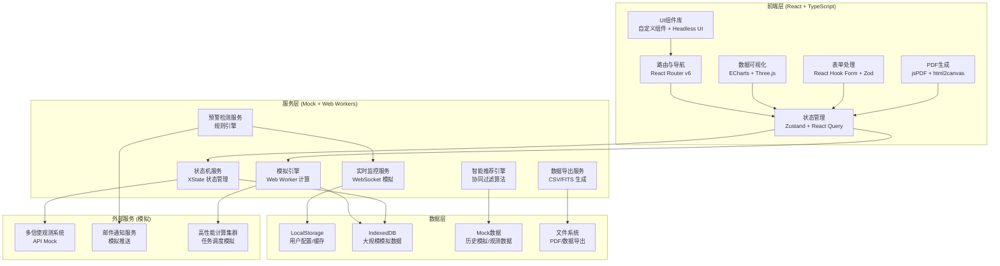
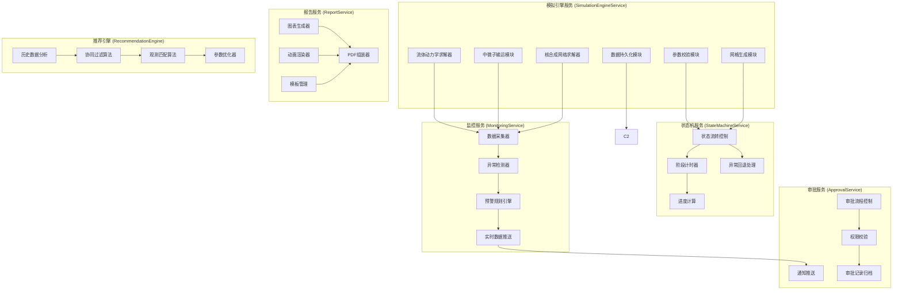
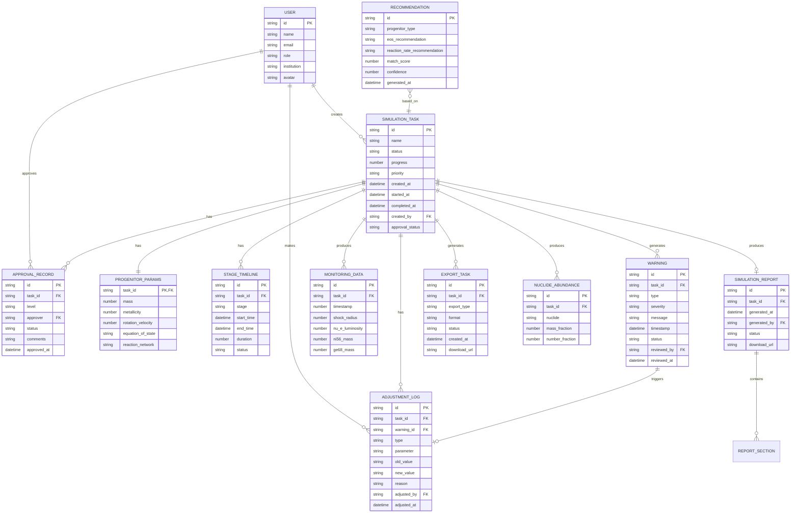

## 1. 架构设计



## 2. 技术描述

### 2.1 前端技术栈
- **框架**: React@18.2.0 + TypeScript@5.3.0
- **构建工具**: Vite@5.0.0
- **样式方案**: TailwindCSS@3.4.0 + PostCSS
- **状态管理**: 
  - Zustand@4.4.0 (全局状态)
  - React Query@5.0.0 (服务端状态/缓存)
  - XState@4.38.0 (状态机管理模拟流程)
- **路由**: React Router@6.20.0
- **数据可视化**:
  - ECharts@5.4.3 (2D图表: 曲线、柱状图、雷达图)
  - Three.js@0.160.0 + @react-three/fiber@8.15.0 (3D流体网格可视化)
  - @react-three/drei@9.92.0 (3D辅助组件)
- **表单验证**: React Hook Form@7.48.0 + Zod@3.22.0
- **PDF生成**: jsPDF@2.5.1 + html2canvas@1.4.1
- **日期处理**: date-fns@2.30.0
- **图标**: Lucide React@0.294.0
- **动画**: Framer Motion@10.16.0

### 2.2 后端与计算层 (模拟实现)
- **Web Workers**: 处理密集型模拟计算，避免阻塞UI
- **IndexedDB**: 存储大规模时间序列数据和流体网格数据
- **LocalStorage**: 存储用户配置、视图偏好、会话状态
- **Mock API**: 使用MSW@2.0.0模拟后端接口，提供真实数据体验

### 2.3 项目初始化
使用 Vite React TypeScript 模板初始化项目：
```bash
npm create vite@latest supernova-sim-platform -- --template react-ts
```

### 2.4 设计系统
- **CSS变量体系**: 深空蓝主题，完整的色彩、间距、字体、阴影系统
- **组件设计原子化**: 基础组件 → 业务组件 → 页面组件三级结构
- **响应式断点**: sm(640px)、md(768px)、lg(1024px)、xl(1280px)、2xl(1536px)

## 3. 路由定义

| 路由路径 | 页面名称 | 权限要求 | 主要功能 |
|---------|----------|----------|----------|
| `/` | 首页看板 | 所有登录用户 | 系统概览、快速创建任务、最近任务、预警提醒 |
| `/tasks` | 任务列表 | 所有登录用户 | 任务筛选、批量操作、任务卡片列表 |
| `/tasks/:id` | 任务详情 | 任务创建者/审批人 | 参数查看、状态流转、实时监控、模拟日志 |
| `/tasks/create` | 创建任务 | 博士后/物理学家 | 前身星参数配置、模拟选项设置 |
| `/monitoring` | 监控中心 | 所有登录用户 | 激波监控、中微子监控、核合成监控、实时预警 |
| `/alerts` | 预警中心 | 物理学家/教授 | 预警列表、异常复核、参数调整 |
| `/approvals` | 审批中心 | 博士后/教授 | 待审批列表、激波验证、核合成确认 |
| `/reports` | 报告中心 | 所有登录用户 | 报告列表、报告生成器、PDF预览下载 |
| `/export` | 数据导出 | 所有登录用户 | 导出配置、导出任务管理、数据下载 |
| `/recommendations` | 智能推荐 | 所有登录用户 | 参数推荐、匹配分析、历史对比 |
| `/dashboard` | 统计看板 | 教授/管理员 | 每日统计、性能雷达图、趋势分析 |
| `/settings` | 系统配置 | 管理员 | 状态方程管理、核反应网络、预警阈值 |
| `/login` | 登录页 | 公开 | 用户登录、角色选择 |

## 4. API 定义 (TypeScript 类型)

### 4.1 核心数据类型

```typescript
// 前身星参数
interface ProgenitorParams {
  mass: number;           // 前身星质量 (M☉)
  metallicity: number;    // 金属丰度 [Fe/H]
  rotationVelocity: number; // 旋转速度 (km/s)
  equationOfState: string; // 状态方程版本
  reactionNetwork: string; // 核反应网络版本
}

// 模拟任务状态枚举
enum SimulationStatus {
  PENDING_VALIDATION = 'pending_validation',
  GRID_GENERATION = 'grid_generation',
  COLLAPSE_PHASE = 'collapse_phase',
  SHOCK_BOUNCE = 'shock_bounce',
  NUCLEOSYNTHESIS = 'nucleosynthesis',
  COMPLETED = 'completed',
  ABNORMAL_FALLBACK = 'abnormal_fallback',
  PAUSED = 'paused',
  CANCELLED = 'cancelled'
}

// 模拟任务
interface SimulationTask {
  id: string;
  name: string;
  parameters: ProgenitorParams;
  status: SimulationStatus;
  progress: number;
  priority: 'low' | 'medium' | 'high';
  createdAt: Date;
  startedAt: Date | null;
  completedAt: Date | null;
  createdBy: string;
  assignedTo: string[];
  currentStage: string;
  stageTimeline: StageTimelineItem[];
  warnings: Warning[];
  adjustments: AdjustmentLog[];
  approvalStatus: ApprovalStatus;
}

// 阶段时间线
interface StageTimelineItem {
  stage: SimulationStatus;
  startTime: Date;
  endTime: Date | null;
  duration: number;
  status: 'pending' | 'running' | 'completed' | 'failed';
}

// 预警信息
interface Warning {
  id: string;
  taskId: string;
  type: 'shock_stagnation' | 'neutrino_anomaly' | 'ni56_deviation' | 'convergence_issue';
  severity: 'critical' | 'warning' | 'info';
  message: string;
  timestamp: Date;
  data: WarningData;
  reviewedBy: string | null;
  reviewedAt: Date | null;
  resolution: string | null;
  status: 'pending' | 'reviewed' | 'resolved';
}

// 监控数据点
interface MonitoringDataPoint {
  timestamp: number;          // 时间戳 (ms post-bounce)
  shockRadius: number;        // 激波半径 (km)
  shockVelocity: number;      // 激波速度 (cm/s)
  nu_e_luminosity: number;    // 电子中微之光度 (erg/s)
  nu_ebar_luminosity: number; // 反电子中微之光度 (erg/s)
  nu_x_luminosity: number;    // 重子中微之光度 (erg/s)
  ni56_mass: number;          // 镍-56质量 (M☉)
  ge68_mass: number;          // 锗-68质量 (M☉)
  totalEnergy: number;        // 总能量 (erg)
  entropy: number;            // 熵 (kB/baryon)
}

// 核素丰度
interface NuclideAbundance {
  nuclide: string;
  massNumber: number;
  atomicNumber: number;
  massFraction: number;
  numberFraction: number;
  productionRate: number;
}

// 调整日志
interface AdjustmentLog {
  id: string;
  taskId: string;
  type: 'equation_of_state' | 'reaction_rate' | 'grid_resolution' | 'other';
  parameter: string;
  oldValue: string;
  newValue: string;
  reason: string;
  adjustedBy: string;
  adjustedAt: Date;
  restartCount: number;
}

// 审批状态
enum ApprovalStatus {
  NOT_SUBMITTED = 'not_submitted',
  POSTDOC_PENDING = 'postdoc_pending',
  POSTDOC_APPROVED = 'postdoc_approved',
  POSTDOC_REJECTED = 'postdoc_rejected',
  PROFESSOR_PENDING = 'professor_pending',
  PROFESSOR_APPROVED = 'professor_approved',
  PROFESSOR_REJECTED = 'professor_rejected'
}

// 审批记录
interface ApprovalRecord {
  id: string;
  taskId: string;
  level: 'postdoc' | 'professor';
  approver: string;
  status: 'approved' | 'rejected';
  comments: string;
  approvedAt: Date;
  shockDynamicsVerification: ShockVerification;
  nucleosynthesisAssessment: NucleosynthesisAssessment;
}

// 激波验证
interface ShockVerification {
  shockVelocityValid: boolean;
  radiusEvolutionValid: boolean;
  energyConservationValid: boolean;
  comments: string;
}

// 核合成评估
interface NucleosynthesisAssessment {
  ni56YieldValid: boolean;
  abundanceDistributionValid: boolean;
  observationMatch: number; // 0-100 匹配度
  comments: string;
}

// 生成报告
interface SimulationReport {
  id: string;
  taskId: string;
  generatedAt: Date;
  generatedBy: string;
  sections: ReportSection[];
  status: 'generating' | 'completed' | 'failed';
  downloadUrl: string;
}

// 报告章节
interface ReportSection {
  type: 'shock_animation' | 'abundance_distribution' | 'light_curve' | 'neutrino_spectrum' | 'summary';
  title: string;
  data: any;
}

// 导出任务
interface ExportTask {
  id: string;
  taskId: string;
  exportType: 'hydrodynamics' | 'nucleosynthesis' | 'all';
  progenitorType: string;
  reactionNetworkVersion: string;
  timeWindow: { start: number; end: number };
  format: 'csv' | 'fits' | 'hdf5';
  status: 'pending' | 'processing' | 'completed' | 'failed';
  createdAt: Date;
  downloadUrl: string;
}

// 智能推荐
interface Recommendation {
  id: string;
  progenitorType: string;
  targetObservations: string[];
  recommendedEquationOfState: string;
  recommendedReactionRates: string;
  matchScore: number;
  confidence: number;
  supportingSimulations: string[];
  generatedAt: Date;
}

// 每日统计
interface DailyStatistics {
  date: Date;
  totalTasks: number;
  completedTasks: number;
  completionRate: number;
  shockRecoverySuccessRate: number;
  networkConvergenceCount: number;
  avgSimulationTime: number;
  warningsCount: number;
  criticalWarningsCount: number;
}

// 性能指标
interface PerformanceMetrics {
  accuracy: number;      // 精度 0-100
  speed: number;         // 速度 0-100
  stability: number;     // 稳定性 0-100
  convergence: number;   // 收敛性 0-100
  resourceUtilization: number; // 资源利用率 0-100
}

// 用户信息
interface User {
  id: string;
  name: string;
  email: string;
  role: 'postdoc' | 'professor' | 'physicist' | 'admin';
  institution: string;
  avatar: string;
}
```

### 4.2 API 接口定义

```typescript
// 任务相关接口
interface TaskAPI {
  list(params: ListParams): Promise<PaginatedResponse<SimulationTask>>;
  get(id: string): Promise<SimulationTask>;
  create(params: ProgenitorParams): Promise<SimulationTask>;
  update(id: string, params: Partial<SimulationTask>): Promise<SimulationTask>;
  delete(id: string): Promise<void>;
  pause(id: string): Promise<SimulationTask>;
  resume(id: string): Promise<SimulationTask>;
  restart(id: string): Promise<SimulationTask>;
}

// 监控相关接口
interface MonitoringAPI {
  getRealtimeData(taskId: string): Promise<MonitoringDataPoint[]>;
  getHistoricalData(taskId: string, timeRange: TimeRange): Promise<MonitoringDataPoint[]>;
  subscribe(taskId: string, callback: (data: MonitoringDataPoint) => void): () => void;
}

// 预警相关接口
interface AlertAPI {
  list(params: AlertListParams): Promise<PaginatedResponse<Warning>>;
  review(id: string, params: ReviewParams): Promise<Warning>;
  resolve(id: string, params: ResolveParams): Promise<Warning>;
  subscribe(callback: (warning: Warning) => void): () => void;
}

// 审批相关接口
interface ApprovalAPI {
  listPending(level: 'postdoc' | 'professor'): Promise<SimulationTask[]>;
  submitForApproval(taskId: string, level: 'postdoc' | 'professor'): Promise<void>;
  approve(taskId: string, params: ApprovalParams): Promise<ApprovalRecord>;
  reject(taskId: string, params: RejectionParams): Promise<ApprovalRecord>;
  getHistory(taskId: string): Promise<ApprovalRecord[]>;
}

// 报告相关接口
interface ReportAPI {
  list(params: ListParams): Promise<PaginatedResponse<SimulationReport>>;
  generate(taskId: string, config: ReportConfig): Promise<SimulationReport>;
  download(id: string): Promise<Blob>;
  preview(id: string): Promise<string>;
}

// 导出相关接口
interface ExportAPI {
  list(params: ListParams): Promise<PaginatedResponse<ExportTask>>;
  create(params: ExportConfig): Promise<ExportTask>;
  download(id: string): Promise<Blob>;
  cancel(id: string): Promise<void>;
}

// 推荐相关接口
interface RecommendationAPI {
  getForProgenitor(progenitorType: string): Promise<Recommendation[]>;
  getMatchAnalysis(recommendationId: string, observationId: string): Promise<MatchAnalysis>;
  getHistory(): Promise<Recommendation[]>;
}

// 统计相关接口
interface StatisticsAPI {
  getDailyStats(dateRange: DateRange): Promise<DailyStatistics[]>;
  getPerformanceMetrics(taskIds: string[]): Promise<PerformanceMetrics[]>;
  getNi56Deviation(progenitorType: string): Promise<Ni56DeviationReport>;
}

// 配置相关接口
interface ConfigAPI {
  getEquationsOfState(): Promise<ConfigItem[]>;
  getReactionNetworks(): Promise<ConfigItem[]>;
  getWarningThresholds(): Promise<WarningThresholds>;
  updateWarningThresholds(params: WarningThresholds): Promise<WarningThresholds>;
}
```

## 5. 服务层架构图



## 6. 数据模型

### 6.1 实体关系图



### 6.2 IndexedDB 数据存储方案

```typescript
// 数据库版本和存储配置
const DB_CONFIG = {
  name: 'supernova_sim_db',
  version: 1,
  stores: {
    tasks: { keyPath: 'id', autoIncrement: false },
    monitoringData: { keyPath: 'id', autoIncrement: true, indexes: ['taskId', 'timestamp'] },
    nuclideData: { keyPath: 'id', autoIncrement: true, indexes: ['taskId', 'nuclide'] },
    warnings: { keyPath: 'id', autoIncrement: false },
    adjustments: { keyPath: 'id', autoIncrement: false },
    approvals: { keyPath: 'id', autoIncrement: false },
    reports: { keyPath: 'id', autoIncrement: false },
    exports: { keyPath: 'id', autoIncrement: false },
    dailyStats: { keyPath: 'date', autoIncrement: false },
    recommendations: { keyPath: 'id', autoIncrement: false }
  }
};
```

### 6.3 初始数据种子

系统将包含以下模拟数据：
- 10个历史模拟任务（覆盖不同前身星类型）
- 完整的状态流转时间线
- 200+条监控数据点（用于展示历史趋势）
- 5条预警记录（含已处理和待处理）
- 3条审批记录
- 2份已生成的PDF报告
- 5条智能推荐记录
- 30天的每日统计数据
- 4个状态方程配置
- 3个核反应网络配置
